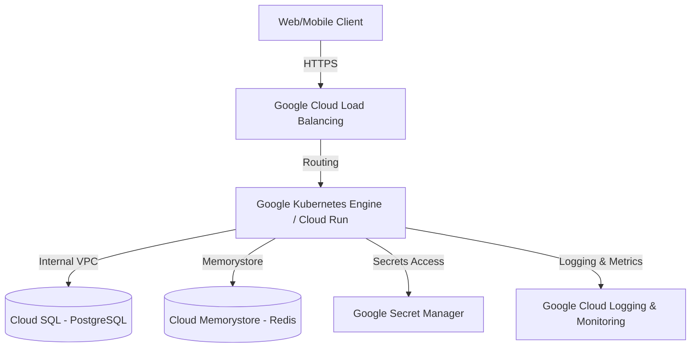

# Google Cloud Platform (GCP) Deployment & Hosting Guide
## ClinCommand OS™ Enterprise Production Edition

This guide outlines the architecture, setup, and deployment processes for hosting ClinCommand OS™ on Google Cloud Platform (GCP) under GxP compliance guidelines.

---

## 1. High-Level Architecture

The GCP hosting topology leverages managed services for high availability, automatic scaling, strict IAM governance, and automatic patching:



---

## 2. Component Configurations

### A. Google Cloud Run (Frontend / API Core)
Cloud Run provides serverless container hosting with scale-to-zero capabilities.

1. **Service Definition**:
   Deploy using container images stored in Google Artifact Registry:
   - Frontend: `gcr.io/clincommand-prod/web:v16.2`
   - API: `gcr.io/clincommand-prod/api:v16.2`
2. **Security Boundaries**:
   - Set ingress settings to `Internal and Cloud Load Balancing` to prevent direct public access.
   - Attach a VPC Connector to access Cloud SQL and Redis instances securely without public IPs.

### B. Google Kubernetes Engine (GKE)
For full-featured container orchestration, utilize GKE Autopilot.

1. **Cluster Creation**:
   ```bash
   gcloud container clusters create-auto clincommand-prod-cluster \
       --region=asia-east1 \
       --project=clincommand-prod
   ```
2. **Applying Manifests**:
   ```bash
   kubectl apply -f infrastructure/k8s-production/namespace.yaml
   kubectl apply -f infrastructure/k8s-production/secrets-template.yaml
   kubectl apply -f infrastructure/k8s-production/deployment-api.yaml
   kubectl apply -f infrastructure/k8s-production/deployment-web.yaml
   kubectl apply -f infrastructure/k8s-production/service-api.yaml
   kubectl apply -f infrastructure/k8s-production/service-web.yaml
   kubectl apply -f infrastructure/k8s-production/ingress.yaml
   kubectl apply -f infrastructure/k8s-production/hpa.yaml
   ```

### C. Cloud SQL (PostgreSQL Enterprise)
Highly-available, GxP-qualified relational database.

- **Engine Version**: PostgreSQL 15 or higher.
- **HA configuration**: Regional deployment (Primary + Standby in separate Zones).
- **Private IP only**: Disable public IP address and configure Private Service Access inside the project VPC.
- **Backup Strategy**: Enable automated daily backups with Point-In-Time Recovery (PITR) retained for 365 days.

### D. Google Secret Manager (GSM)
Used to securely store API keys, database credentials, and signing keys.

- secrets are automatically mapped at runtime to environment variables via the secret manager wrapper or Kubernetes external secrets integrations.

---

## 3. Compliance & Attributions

This hosting architecture satisfies GxP requirements including data protection (encryption-at-rest with customer-managed keys/CMEK, encryption-in-transit via TLS 1.3), complete audit logging via Cloud Audit Logs, and multi-region disaster recovery replication.

---

© Dr. Bhupesh Dewan, Mumbai, India — All Rights Reserved
