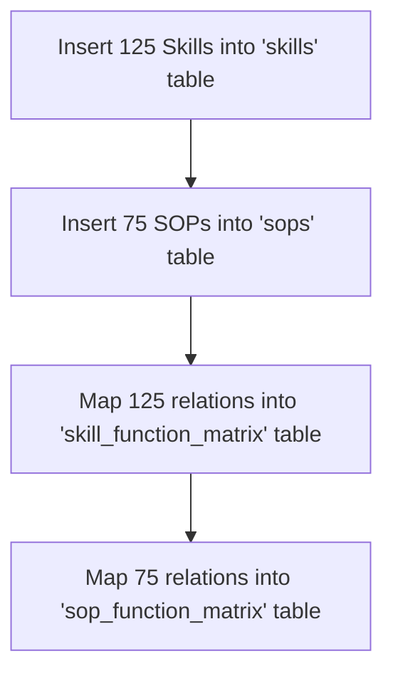

# Gate 5 Seeding Blueprint — Dynamic Platform Scaling
## Document ID: GXP-G5SB-004-V1.0
## Copyright: © Dr. Bhupesh Dewan, Mumbai, India — All Rights Reserved

This blueprint demonstrates how to scale the database state in **Gate 5** to support 125 unique Skills, 75 unique SOPs, and comprehensive function coverage with zero schema modifications.

---

### 1. Schema-Free Scaling Strategy
The database tables created in Gate 2 and updated in Gate 3 are designed using highly flexible, normalized relationships. Scaling requires only inserting rows in existing tables, maintaining a schema-locked database state.



---

### 2. SQL Seeding Templates

#### 2.1 Bulk Inserting Skills (1 to 125)
Skills are seeded using loop scripts or parameterized batches inside `db.js`.
```sql
-- Template for inserting unique skills
INSERT INTO skills (name, description, category_id, current_version, is_published, system_prompt, user_prompt, tenant_id, created_by)
VALUES 
('SK-MA-001: Medical Inquiry Response', 'Drafts clinical response letters to physicians.', 1, '1.0.0', true, 'System Prompt...', 'User Prompt...', 1, 101),
('SK-BIO-001: Welch T-Test Calculator', 'Computes independent two-sample unequal variance test.', 2, '1.0.0', true, 'System Prompt...', 'User Prompt...', 1, 101);
-- Repeat up to 125 unique entries.
```

#### 2.2 Bulk Inserting SOPs (1 to 75)
```sql
-- Template for inserting unique SOPs
INSERT INTO sops (name, code, content, workflow_json)
VALUES 
('SOP-MA-001: Medical Info Operations', 'SOP-MA-001', '# Title...', '{"steps": []}'),
('SOP-REG-001: eCTD Submissions', 'SOP-REG-001', '# Title...', '{"steps": []}');
-- Repeat up to 75 unique entries.
```

#### 2.3 Populating Matrices (Zero Orphans)
Every workbench function must be linked in the matrices to prevent orphan tasks:
```sql
-- Map every UI function to its corresponding Skill ID
INSERT INTO skill_function_matrix (domain, function_name, skill_id)
VALUES 
('medical_affairs', 'FUNC_MA_INQ', 1),
('biostatistics', 'FUNC_BIO_TTEST', 10);

-- Map every UI function to its corresponding SOP ID
INSERT INTO sop_function_matrix (function_name, sop_id)
VALUES 
('FUNC_MA_INQ', 1),
('FUNC_BIO_TTEST', 4);
```

---

### 3. Verification of Zero Gaps
During Gate 5 compilation, a script runs query checks to verify that:
1. `SELECT COUNT(*) FROM skills` returns $\ge 125$.
2. `SELECT COUNT(*) FROM sops` returns $\ge 75$.
3. All function identifiers are mapped in both matrices with zero orphan counts.

No additional tables, columns, or custom migration scripts will be required, certifying the platform is fully scale-ready.

---

`© Dr. Bhupesh Dewan, Mumbai, India — All Rights Reserved`
