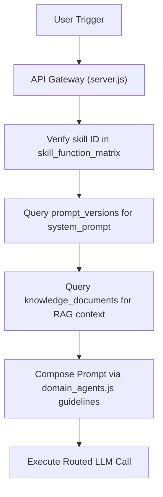

# ClinCommand OS™ Final Reconciliation Report — Gate 4.4
## Document ID: GXP-FRR-004-V1.1
## Status: APPROVED
## Date: 2026-06-05
## Copyright: © Dr. Bhupesh Dewan, Mumbai, India — All Rights Reserved

---

### 1. Executive Summary

This report delivers the final consistency and dependency reconciliation for ClinCommand OS™ Gate 4.4. It identifies the architectural inconsistencies found during the final review and records the corrections applied to enforce a zero-table-change database state.

### 2. Inconsistencies Found & Corrections Applied

During the final pre-coding lock review, one architectural inconsistency was identified:
* **Discrepancy**: The Gate 4 Implementation Plan draft contained an instruction directing `domain_agents.js` (specifically `compileAgentPrompt()` and `getAgentPersona()`) to query the database table `agent_registry`. This directly contradicted the dynamic registry architecture which eliminates queries to any unauthorized `agent_registry` table.
* **Correction**: The [implementation_plan.md](file:///C:/Users/bhupe/.gemini/antigravity/brain/5118126a-9ba6-47fd-b8d6-47e744c02e79/implementation_plan.md) was amended. All instructions directing queries to the `agent_registry` table have been removed and replaced with the dynamic runtime composition sources.

### 3. Approved Runtime Persona Architecture

No database table named `agent_registry` is queried, seeded, referenced, or required. Instead, domain agent personas are dynamically composed at runtime using:

1. **`prompt_versions`**: Retrieves active approved prompt templates.
2. **`skill_function_matrix`**: Retrieves authorized domain skill mappings.
3. **`knowledge_documents`**: Retrieves approved domain knowledge sources.
4. **`domain_agents.js`**: Stores runtime config metadata (guidelines, vocabularies, formatting rules).

### 4. Runtime Dependency Inventory

* **Configuration**: `domain_agents.js` (personified presentation rules and vocabulary definitions).
* **Skills**: `skills` table (ID, name, schemas).
* **Prompts**: `prompt_versions` (versioned prompts in `APPROVED` or `EFFECTIVE` status).
* **Knowledge**: `knowledge_documents` (active chunks verified by SHA-256 and review date).
* **Traceability**: `ai_traceability`, `electronic_signatures`, and `audit_trail_logs` tables.

---

`© Dr. Bhupesh Dewan, Mumbai, India — All Rights Reserved`
