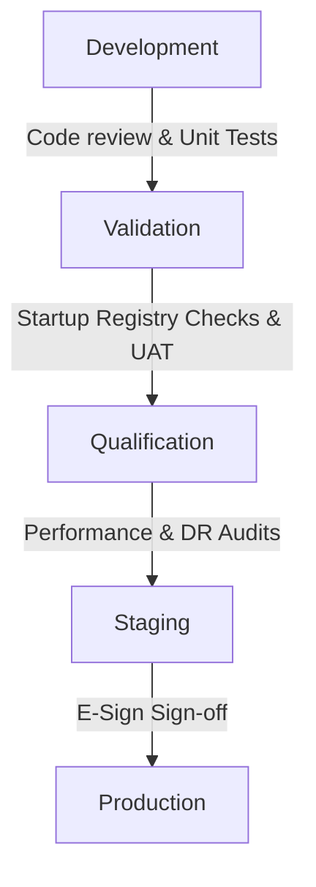

# ClinCommand OS™ Gate 4.9 Controlled Release Management Plan
**Author:** Dr. Bhupesh Dewan, Mumbai, India  
**Copyright Notice:** © Dr. Bhupesh Dewan, Mumbai, India — All Rights Reserved  
**Status:** PASS  

## 1. Release Lifecycle Stages

ClinCommand OS™ enforces a controlled release flow to ensure that no unvalidated changes enter production environments:

1. **Development**: Feature work, automated unit testing, and preliminary lint checks.
2. **Validation**: Deploy to validation workspace where startup validation checks are run against standard schemas.
3. **Qualification**: Release qualification tests run (82+ assertions and 100+ production readiness assertions).
4. **Staging**: Pre-production mirror environment where manual UAT and simulation tests run.
5. **Production**: Live environment with high-availability clustering and active security RLS.

---

## 2. Release Authorization Controls

- **Approval Requirements**: Deployments to Staging/Production require a minimum of three electronic signatures:
  1. Head of Development / Quality Engineering (QE)
  2. Head of Clinical/Medical Governance
  3. Head of Regulatory Compliance
- **Deployment Authorization**: Formally signed off via electronic signature in the system before production keys are injected.
- **Rollback Authorization**: Authorized by the Release Manager if critical startup validation error rates exceed thresholds.
- **Emergency Fixes**: Executed through hotfix branches. Emergency fixes require accelerated startup verification and a post-mortem review within 24 hours.

---

## 3. Release Audit Trail Registry

Every release generates an immutable log entry containing:

| Field Name | Type | Description |
|---|---|---|
| **Release ID** | UUID | Cryptographically generated unique identifier for the release event. |
| **Version** | String | SemVer release tag (e.g. `v4.9.0`). |
| **Approver** | String | Username of the certifying officer. |
| **Timestamp** | ISO-8601 | The exact UTC timestamp of deployment execution. |
| **Deployment Result** | String | Status indicator (`SUCCESS`, `FAILED`, `ROLLED_BACK`). |
| **Audit Link ID** | String | Key linking to the Merkle audit trail for the deployment sign-off. |

---

**Release Governance:** CONTROLLED  
**Attribution:** © Dr. Bhupesh Dewan, Mumbai, India — All Rights Reserved  
