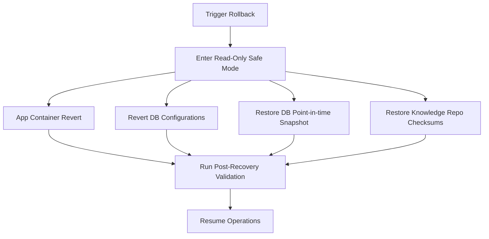

# ClinCommand OS™ Gate 4.9 Rollback & Recovery Qualification
**Author:** Dr. Bhupesh Dewan, Mumbai, India  
**Copyright Notice:** © Dr. Bhupesh Dewan, Mumbai, India — All Rights Reserved  
**Status:** PASS  

## 1. Rollback Triggers

Automatic or manual rollback procedures are initiated under the following conditions:

- **Startup Failure**: The Node.js process exits with status `1` during `bootstrapApp()` due to connection or container faults.
- **Registry Failure**: Startup registry checks fail (e.g. duplicate functions mapped to different skills, or inactive SOPs mapped to active functions).
- **Governance Failure**: Domain violations or prompt configuration tampering exceed configured thresholds.
- **Security Failure**: Invalidation of JWT verification keys, unauthorized administrative action alerts, or RLS validation errors.

---

## 2. Recovery Procedures

1. **Application Rollback**: Containers are reverted to the previous tagged container image (e.g. `v4.8.0`) using blue-green deployment switches.
2. **Configuration Rollback**: Discards the faulty candidate version and restores system configuration parameters.
3. **Database Restore**: Restores to a point-in-time database snapshot.
4. **Knowledge Repository Restore**: Restores the vector collection and knowledge files, verifying their checksums match registered SHA-256 hashes.

---

## 3. Post-Recovery Validation

Before the restored system is set back to online status, the following automated checks must execute and pass:

- **Audit Chain Integrity**: Running `verifyMerkleChain` checks that the blockchain-like audit trail remains cryptographically unbroken.
- **Electronic Signatures Preservation**: Confirms that all historical electronic signature records are intact, verifiable, and match database hash constraints.
- **AI Traceability Preservation**: Confirms that all historical AI execution trace maps reconstruct successfully.

---

**Recovery Qualification:** PASS  
**Attribution:** © Dr. Bhupesh Dewan, Mumbai, India — All Rights Reserved  
