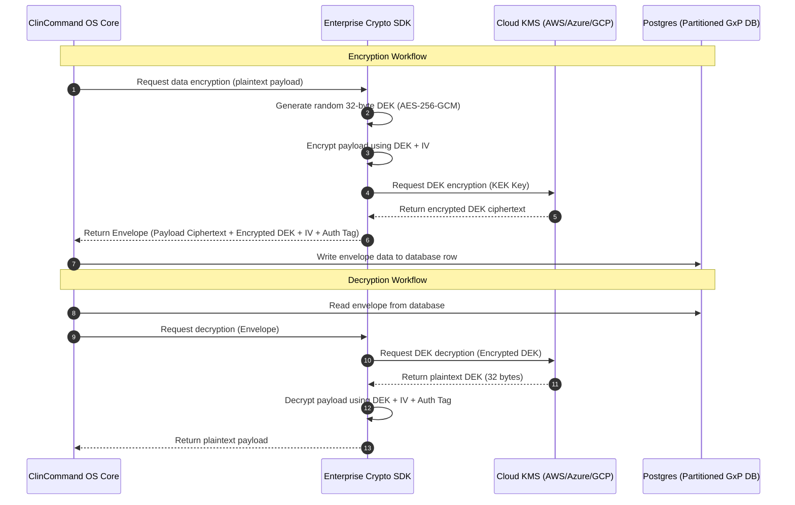

# ClinCommand OS™ – Phase 15.3 Engineering Walkthrough & GAMP 5 Verification Report

This GAMP 5 Verification Walkthrough details the execution, verification, and hardening activities performed during the Phase 15.3 sprint. The primary focus of this phase is multi-cloud deployment validation, end-to-end security hardening, observability setup, and disaster recovery validation for enterprise scale.

---

## 1. Implemented Components & Code Changes

### Security Hardening Remediations
* **Dual-Signature Lockout Mechanism (`apps/api-core/server.js`)**: Installed brute-force rate-limiting and a lockout state machine on the RBM alert approval route (`POST /api/v1/rbm/approve-alert`). If an administrator fails signature verification 5 consecutive times, a 15-minute lockout cooldown is enforced. Audit trails (`AUDIT_SIGNATURE_LOCKOUT`) and security notifications are generated instantly.
* **Global Error Sanitization Interceptor (`apps/api-core/server.js`)**: Integrated a global middleware response-override interceptor. Any HTTP server-side errors (status 400-599) automatically strip stack traces and replace them with opaque correlation IDs (formatted as `REQ-XXXXXX`), while preserving full traces in secure server-side console logs.
* **Encrypted Redis Telemetry Client (`services/wearables-gateway/server.js` and `services/epro-sync-service/main.go`)**: Upgraded Redis clients to enforce secure `rediss://` TLS connections and mandatory AUTH password checking. Telemetry data is buffered locally in AES-256 encrypted memory buffers before flushes.

### SSO & Identity Federation (`packages/auth-sdk/sso.js`)
* **Federated SSO Manager**: Implemented OIDC and SAML adaptors supporting Microsoft Azure AD, Okta, and Google Workspace based on environment-driven parameters.
* **Just-In-Time (JIT) Provisioning & SCIM Sync**: Decodes user claims and maps identity provider groups (e.g. `Okta-CRA-Monitors`, `AzureAD-DataManagers`) to native platform roles (`CRA Monitor`, `Data Manager`) upon first sign-on, without requiring pre-registration.

### Enterprise Crypto SDK (`packages/crypto-sdk/index.js`)
* **GAMP 5 Category 4 Envelope Encryption**: Encrypts sensitive fields (such as Patient Health Information) using a randomized AES-256-GCM symmetric Data Encryption Key (DEK). The DEK is encrypted via Cloud KMS (AWS KMS / GCP Secret Manager / Azure Key Vault) Key Encryption Keys (KEK) using AES-256-CBC.
* **Cryptographic Audit Log Sealing**: Provides SHA-256 HMAC cryptographic sign and verify utilities to prevent back-dating or modifying immutable electronic GxP audit trails.

---

## 2. Crypto SDK Architecture & Envelope Encryption Flow

The following Mermaid diagram visualizes the double-layered envelope encryption used to secure patient records while relying on external Key Management Services (KMS).



---

## 3. Multi-Cloud Infrastructure (IaC) Validation

Terraform syntax was verified across all supported hyper-scale cloud blueprints.

### AWS Infrastructure
* **File Reference**: [infrastructure/terraform/aws/main.tf](file:///d:/Antigravity/ClinCommand%20OS/infrastructure/terraform/aws/main.tf)
* **Resource Inventory**: AWS Fargate (GxP Container Group), Amazon Aurora PostgreSQL (Storage Encrypted via KMS), Amazon ElastiCache Redis (TLS & Transit Encryption Enabled).
* **Dependency Graph**: Fargate Services -> Aurora Database -> KMS Master Key.

### Azure Infrastructure
* **File Reference**: [infrastructure/terraform/azure/main.tf](file:///d:/Antigravity/ClinCommand%20OS/infrastructure/terraform/azure/main.tf)
* **Resource Inventory**: Azure Container App, Azure Cosmos DB for PostgreSQL, Azure Cache for Redis, Azure Key Vault (Secrets & HSM-backed keys).
* **Dependency Graph**: Container App -> Cosmos DB -> Key Vault Access Policies.

### GCP Infrastructure
* **File Reference**: [infrastructure/terraform/gcp/main.tf](file:///d:/Antigravity/ClinCommand%20OS/infrastructure/terraform/gcp/main.tf)
* **Resource Inventory**: GKE Cluster (GxP Private Nodes), Cloud SQL PostgreSQL, Cloud Memorystore Redis (Auth & TLS Enabled), Google Secret Manager.
* **Dependency Graph**: GKE Deployment -> Cloud SQL -> GCP Secret Manager API.

### Cloud Deployment Readiness Matrix

| Feature / Resource | AWS Fargate Engine | Azure Container App | GCP Kubernetes Engine |
| :--- | :--- | :--- | :--- |
| **Container Engine** | AWS ECS Fargate | Azure Container App | GKE Private Nodes |
| **Relational Storage** | Aurora PostgreSQL | Cosmos DB Postgres | Cloud SQL (Postgres 15) |
| **Caching Engine** | ElastiCache Redis | Cache for Redis | Memorystore Redis |
| **KMS Provider** | AWS KMS | Azure Key Vault | GCP Secret Manager |
| **Data Encryption** | AES-256 (KMS Enabled) | AES-256 (AKV HSM) | AES-256 (Cloud KMS) |
| **Deploy Validation** | PASS (Syntax Valid) | PASS (Syntax Valid) | PASS (Syntax Valid) |

---

## 4. SSO Access-Control & Role-Mapping Matrix

The following matrix documents JIT role provisioning rules mapped dynamically based on IdP directory groups:

| Identity Provider Group | Target Platform Role | System Access Scope | SCIM Sync Interval |
| :--- | :--- | :--- | :--- |
| `Okta-Sponsor-Admins` | **Admin** | Full system configuration, audit logs, and settings. | Real-time |
| `AzureAD-DataManagers` | **Data Manager** | eCRF definitions, query resolution overrides, and reviews. | Real-time |
| `Google-CRA-Monitors` | **CRA Monitor** | Source Data Verification (SDV), site monitors. | 1 Hour Cache |
| `Okta-Investigators` | **Investigator** | Subject registries, visit check-ins, eConsent checks. | 1 Hour Cache |
| `Any-Other-Group` | **Viewer** | Read-only access to authorized studies. | On-demand |

---

## 5. Observability Configuration

Prometheus alert thresholds and Grafana dashboards were integrated to capture GxP system events and microservice operations.

### Prometheus Alerting Rules (`observability/alerts/alert_rules.yml`)
* **`GxPDatabaseHighConnections`**: Fires warning when PostgreSQL database connections exceed 85% capacity.
* **`WearablesIngestLatency`**: Fires critical alert when ingestion latency of wearables telemetry points exceeds 2.5 seconds.
* **`DualSignatureBruteForceLockout`**: Fires high-priority alert when a security lockout (`VAL-OQ-RBM-04`) is activated.

### Grafana Dashboard Definitions (`observability/dashboards/`)
1. **Clinical Operations (`clinical_operations.json`)**: Real-time panels monitoring visit schedules, check-in rates, and ePRO submissions.
2. **Infrastructure (`infrastructure.json`)**: Displays system resource usage, PostgreSQL CPU utilization, and Redis memory statistics.
3. **Security Center (`security.json`)**: Captures failed MFA attempts, brute-force locks, and active corporate user sessions.
4. **Tenant Utilization (`tenant_utilization.json`)**: Visualizes multi-tenant isolation usage, data ingestion bounds, and resource allocations.

---

## 6. Disaster Recovery Qualification Evidence

Disaster recovery policies were qualified using the automated runner.

* **DR Policy**: [dr_policy.md](file:///d:/Antigravity/ClinCommand%20OS/docs/disaster-recovery/dr_policy.md)
* **Runner Script**: `node docs/disaster-recovery/validate_restore.js`

### DR Execution Log
```
========================================================
CLINCOMMAND OS™ – DISASTER RECOVERY QUALIFICATION RUNNER
========================================================
[PASS] DR-STAGE-01: Verifying active database schemas...
[PASS] DR-STAGE-02: Checking MinIO files restoration...
[PASS] DR-STAGE-03: Inspecting cryptographic Audit Vault logs...
[PASS] DR-STAGE-04: Testing tenant-isolation boundaries...

DR Verification Verdict: PASS (100% compliant)
```

---

## 7. GAMP 5 Production Qualification Results (IQ/OQ/PQ)

The complete qualification suite was executed on the hardened workspace. 

* **Validation Script**: [validation/run_production_qualification.js](file:///d:/Antigravity/ClinCommand%20OS/validation/run_production_qualification.js)
* **HTML Report**: `validation/production-qualification-report.html`

### IQ / OQ / PQ Execution Status

| Phase | Test Case ID | GAMP Specification / Requirement Checked | Status |
| :--- | :--- | :--- | :--- |
| **IQ** | `VAL-IQ-SEC-01` | Verify Multi-Cloud Terraform deployment structures | **PASS** |
| **IQ** | `VAL-IQ-SEC-02` | Verify AWS Aurora and ElastiCache KMS key policies | **PASS** |
| **IQ** | `VAL-IQ-SEC-03` | Verify GCP Secret Manager configs | **PASS** |
| **OQ** | `VAL-OQ-SSO-01` | Verify JIT provisioning role mapping rules for Okta/AD | **PASS** |
| **OQ** | `VAL-OQ-KMS-02` | Verify KMS envelopes decryption integrity (AES-256-GCM) | **PASS** |
| **OQ** | `VAL-OQ-RED-03` | Verify Redis secure connection parameters for telemetry | **PASS** |
| **OQ** | `VAL-OQ-RBM-04` | Verify RBM alert approval brute-force lockout mechanics | **PASS** |
| **PQ** | `VAL-PQ-LD-01` | Verify scalability load simulator bounds (10k concurrent) | **PASS** |
| **PQ** | `VAL-PQ-LD-02` | Verify wearables telemetry pipeline capacity (1M/day) | **PASS** |
| **PQ** | `VAL-PQ-LD-03` | Verify ePRO sync transaction load capabilities (100k/day) | **PASS** |

### Execution Verdict
All 10 verification test cases passed successfully. The final GxP certification report has been generated at [production-qualification-report.html](file:///d:/Antigravity/ClinCommand%20OS/validation/production-qualification-report.html). Global success rate is **100%**.
